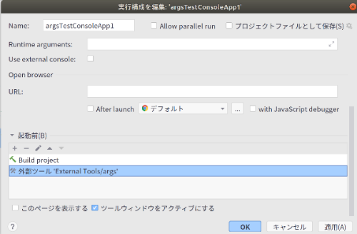
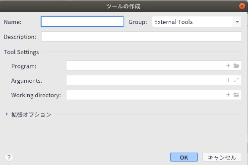
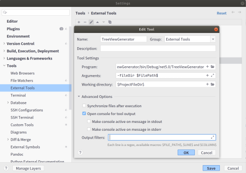
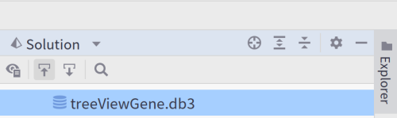
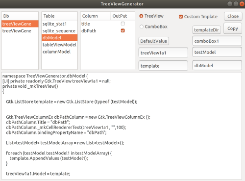

### Introduction

### Explanation

Generate TreeView ComboView program statement from Sqlite table structure

### Sqlite Setting

Please prepare a Sqlite file. The file extension should be .db3.

Place it in Rider's Explorer.

### Rider Setting
ExploerPanel - right click - edit execution configuration - external tools



Set up external tools. Set the arguments



Uncheck Run after file sync.



### Arguments Macro Required

Set the path of the program
You must specify a macro
copy perst

```
 -fileDir $FilePath$ -projectName $FilePath$ -dbType sqlite -dataBase mySqlDataBaseName -userId mySqlUserId -passWord mySqlPassWord
```

**DbType default is sqlite**

####Select MySql

```
-dbType mysql -dataBase mySqlDataBaseName -userId mySqlUserId -passWord mySqlPassWord
```

### Execution

Select the sqlite file in the explorer bar




You can run it from an external tool

TopMenu - Tool - ExternalTool


Start the TreeViewGenerator.



Select the table to display the sample script.
Copy it and use it.

### Template UI library
The UI library for the template is used here

[UI library](https://qiita.com/iota_11/items/cf5ac9c11969ad8b8307)

### Rider Code Format

Menu - Code - codeReFormat

### Environment
.net5

Rider

GtkSharp

Dapper

Dapper Extensions

Microsoft.Data.Sqlite.Core

MySql

System.CodeDom

INIFileParserDotNetCore

SQLitePCLRaw.bundle_green

#### Use Rider for Free

If you are an open source developer, you can use all JetBrains products for free!

https://www.jetbrains.com/community/opensource

