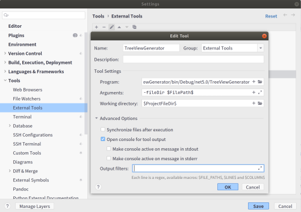
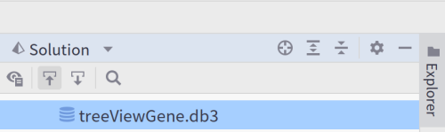
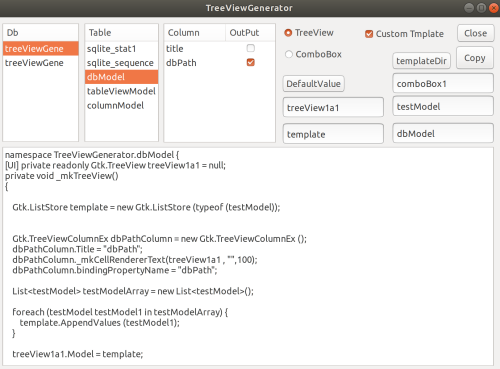

### Introduction

### Explanation

Generate TreeView ComboView program statement from Sqlite table structure
### Environment
.net5

Rider

GtkSharp

Dapper

Dapper Extensions

Microsoft.Data.Sqlite.Core

System.CodeDom

INIFileParserDotNetCore

SQLitePCLRaw.bundle_green

### Rider Setting
ExploerPanel - right click - edit execution configuration - external tools


Set up external tools. Set the arguments


Uncheck Run after file sync.



### Arguments Macro Required

Set the path of the program
You must specify a macro
copy perst

```
 -fileDir $FilePath$
```

### Execution

Select the sqlite file in the explorer bar




You can run it from an external tool

TopMenu - Tool - ExternalTool


Start the TreeViewGenerator.



Select the table to display the sample script.
Copy it and use it.
